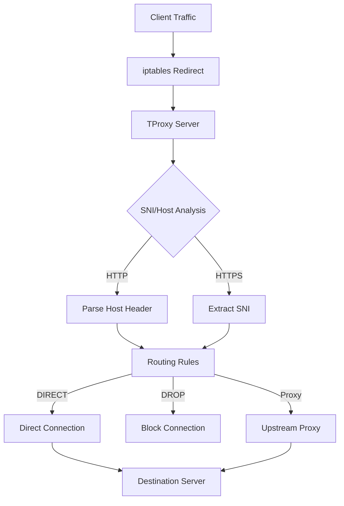

# TProxy - Transparent HTTP/HTTPS Proxy Server Documentation

## Overview

TProxy is a Go implementation of a transparent HTTP/HTTPS proxy server with configurable routing rules. Unlike traditional proxies, it extracts SNI (Server Name Indication) from TLS connections and routes traffic to upstream proxies using domain names instead of IP addresses.

### Key Features

- **Transparent Proxy**: Intercepts traffic without client configuration
- **SNI Extraction**: Extracts domain names from TLS handshakes for intelligent routing
- **Domain-Based Routing**: Routes to upstream proxies using domain names
- **HTTP/HTTPS Support**: Handles both HTTP and HTTPS traffic
- **Configurable Rules**: YAML-based configuration for flexible routing
- **Multi-Architecture Support**: Builds for amd64, arm64, and arm (ARMv7)
- **Docker Support**: Containerized deployment options

## Architecture



## Quick Start

### Prerequisites

- Linux system with iptables support
- Docker (for containerized deployment)
- Root privileges for iptables configuration

### Basic Usage

1. **Download the binary**:
```bash
# For amd64 systems
wget https://github.com/Paucpauc/tproxy-go/releases/latest/download/tproxy-amd64
chmod +x tproxy-amd64
mv tproxy-amd64 /usr/local/bin/tproxy
```

2. **Create configuration**:
```yaml
# /etc/tproxy/proxy_config.yaml
listen:
  host: "127.0.0.1"
  https_port: 3130
  http_port: 3131

rules:
  - pattern: ".*\\.google\\.com"
    proxy: "DIRECT"
  - pattern: ".*\\.yandex\\.ru"
    proxy: "DIRECT"
  - pattern: ".*\\.internal\\.com"
    proxy: "DROP"
  - pattern: ".*"
    proxy: "proxy.example.com:8080"
```

3. **Start the proxy**:
```bash
tproxy --config /etc/tproxy/proxy_config.yaml
```

4. **Configure iptables**:
```bash
# Redirect HTTPS traffic to SNI proxy
iptables -t nat -I PREROUTING -p tcp --dport 443 -j DNAT --to-destination 127.0.0.1:3130

# Redirect HTTP traffic to HTTP proxy
iptables -t nat -I PREROUTING -p tcp --dport 80 -j DNAT --to-destination 127.0.0.1:3131
```

## Installation Methods

### 1. DEB Package (Debian/Ubuntu)

#### Using Pre-built Packages

```bash
# Download the appropriate DEB package
wget https://github.com/Paucpauc/tproxy-go/releases/latest/download/tproxy_1.0.0_amd64.deb

# Install the package
sudo dpkg -i tproxy_1.0.0_amd64.deb

# Install dependencies if needed
sudo apt-get install -f
```

#### Building from Source

```bash
# Clone the repository
git clone https://github.com/Paucpauc/tproxy-go.git
cd tproxy-go

# Build DEB package for current architecture
make docker-packages

# Install the built package
sudo dpkg -i build/packages/deb/tproxy_1.0.0_amd64.deb
```

#### Package Contents

- Binary: `/usr/bin/tproxy`
- Configuration: `/etc/tproxy/proxy_config.yaml`
- Documentation: `/usr/share/doc/tproxy/`

### 2. RPM Package (CentOS/RHEL/Fedora)

#### Using Pre-built Packages

```bash
# Download the appropriate RPM package
wget https://github.com/Paucpauc/tproxy-go/releases/latest/download/tproxy-1.0.0-1.x86_64.rpm

# Install the package
sudo rpm -i tproxy-1.0.0-1.x86_64.rpm
```

#### Building from Source

```bash
# Clone the repository
git clone https://github.com/Paucpauc/tproxy-go.git
cd tproxy-go

# Build RPM package for current architecture
make docker-packages

# Install the built package
sudo rpm -i build/packages/rpm/tproxy-1.0.0-1.x86_64.rpm
```

#### Package Management

```bash
# Check installed package
rpm -qi tproxy

# Verify package files
rpm -ql tproxy

# Remove package
sudo rpm -e tproxy
```

### 3. Docker Deployment

#### Using Pre-built Images

```bash
# Pull the latest image
docker pull ghcr.io/paucpauc/tproxy:latest

# Run the container
docker run -d \
  --name tproxy \
  --network host \
  -v /etc/tproxy:/etc/tproxy \
  -p 3130:3130 \
  -p 3131:3131 \
  ghcr.io/paucpauc/tproxy:latest
```

#### Building Custom Image

```bash
# Clone the repository
git clone https://github.com/Paucpauc/tproxy-go.git
cd tproxy-go

# Build Docker image
docker build -t tproxy:latest .

# Run with custom configuration
docker run -d \
  --name tproxy \
  --network host \
  -v $(pwd)/proxy_config.yaml:/proxy_config.yaml \
  tproxy:latest
```

#### Docker Compose

```yaml
# docker-compose.yml
version: '3.8'
services:
  tproxy:
    image: ghcr.io/paucpauc/tproxy:latest
    network_mode: host
    volumes:
      - ./config:/etc/tproxy
    ports:
      - "3130:3130"
      - "3131:3131"
    restart: unless-stopped
```

### 4. Mikrotik Container Deployment

Mikrotik routers with Container support can run TProxy directly. The ARMv7 build is specifically optimized for Mikrotik HAP AC2 routers.

#### Prerequisites

- Mikrotik router with Container package installed
- Sufficient storage space for the container image
- Network access to download the image

#### Deployment Steps

1. **Prepare the Mikrotik router**:
```bash
# Enable container support
/container config set registry-url=https://registry-1.docker.io tmpdir=flash1

# Create storage for containers
/container mounts add name=tproxy-config src=/flash/tproxy dst=/etc/tproxy
```

2. **Download and run the container**:
```bash
# Pull the ARMv7 image
/container add remote-image=ghcr.io/paucpauc/tproxy:latest-arm \
  interface=bridge \
  root-dir=flash1/tproxy \
  mounts=tproxy-config

# Start the container
/container start 0
```

3. **Configure iptables on Mikrotik**:
```bash
# Redirect HTTP traffic
/ip firewall nat add chain=dstnat protocol=tcp dst-port=80 \
  action=dst-nat to-addresses=127.0.0.1 to-ports=3131

# Redirect HTTPS traffic
/ip firewall nat add chain=dstnat protocol=tcp dst-port=443 \
  action=dst-nat to-addresses=127.0.0.1 to-ports=3130
```

#### Alternative: Manual Binary Deployment

For Mikrotik routers without container support, deploy the ARMv7 binary directly:

1. **Transfer the binary**:
```bash
# Copy binary to Mikrotik
scp build/tproxy-arm admin@mikrotik-ip:/flash/tproxy

# Make executable
/file set tproxy owner=admin group=admin
```

2. **Create startup script**:
```bash
# /flash/tproxy/startup.rsc
/system script add name=start-tproxy source={
    /flash/tproxy --config /flash/tproxy/proxy_config.yaml
}
/system scheduler add name=start-tproxy start-time=startup on-event=start-tproxy
```

## Configuration Guide

### Configuration File Structure

```yaml
listen:
  host: "127.0.0.1"      # Listening interface
  https_port: 3130       # HTTPS/SNI proxy port
  http_port: 3131        # HTTP proxy port

rules:
  - pattern: "regex_pattern"  # Regular expression for domain matching
    proxy: "action"           # Action: DIRECT, DROP, or proxy_host:port
```

### Rule Patterns

- **DIRECT**: Connect directly to the target server
- **DROP**: Block the connection entirely
- **proxy_host:port**: Route through specified upstream proxy

### Example Configurations

#### Basic Corporate Proxy

```yaml
listen:
  host: "0.0.0.0"
  https_port: 3130
  http_port: 3131

rules:
  - pattern: ".*\\.internal\\.company\\.com"
    proxy: "DIRECT"
  - pattern: ".*\\.google\\.com"
    proxy: "DIRECT"
  - pattern: ".*\\.social\\.com"
    proxy: "DROP"
  - pattern: ".*"
    proxy: "corporate-proxy.company.com:8080"
```

#### Multi-Tier Proxy Chain

```yaml
listen:
  host: "127.0.0.1"
  https_port: 3130
  http_port: 3131

rules:
  - pattern: ".*\\.trusted\\.com"
    proxy: "DIRECT"
  - pattern: ".*\\.sensitive\\.com"
    proxy: "secure-proxy.internal:3128"
  - pattern: ".*\\.cdn\\.com"
    proxy: "cdn-proxy.internal:8080"
  - pattern: ".*"
    proxy: "default-proxy.internal:8080"
```

## Advanced Usage

### Systemd Service

Create a systemd service for automatic startup:

```ini
# /etc/systemd/system/tproxy.service
[Unit]
Description=TProxy Transparent Proxy Server
After=network.target

[Service]
Type=simple
User=tproxy
Group=tproxy
ExecStart=/usr/bin/tproxy --config /etc/tproxy/proxy_config.yaml
Restart=always
RestartSec=5

[Install]
WantedBy=multi-user.target
```

Enable and start the service:
```bash
sudo systemctl daemon-reload
sudo systemctl enable tproxy
sudo systemctl start tproxy
```

### Logging and Monitoring

TProxy outputs logs to stdout. For production use, redirect to syslog:

```bash
# Redirect logs to syslog
tproxy --config /etc/tproxy/proxy_config.yaml 2>&1 | logger -t tproxy
```

### Performance Tuning

For high-traffic environments, consider these optimizations:

```bash
# Increase file descriptor limits
echo "* soft nofile 65536" >> /etc/security/limits.conf
echo "* hard nofile 65536" >> /etc/security/limits.conf

# Optimize kernel parameters
echo "net.core.somaxconn = 65536" >> /etc/sysctl.conf
echo "net.ipv4.tcp_max_syn_backlog = 65536" >> /etc/sysctl.conf
sysctl -p
```

## Troubleshooting

### Common Issues

#### Connection Timeouts

**Symptoms**: Connections timeout or hang
**Solutions**:
- Verify upstream proxy connectivity
- Check firewall rules
- Ensure proper DNS resolution

```bash
# Test upstream proxy connectivity
telnet proxy.example.com 8080

# Verify DNS resolution
nslookup proxy.example.com
```

#### iptables Rules Not Working

**Symptoms**: Traffic not being redirected
**Solutions**:
- Verify rule order and precedence
- Check for conflicting rules
- Ensure TProxy is listening on correct ports

```bash
# Check iptables rules
iptables -t nat -L -n -v

# Verify TProxy is listening
netstat -tlnp | grep 313
```

#### SNI Extraction Failures

**Symptoms**: HTTPS connections fail or route incorrectly
**Solutions**:
- Check for non-standard TLS handshakes
- Verify certificate validation
- Test with different clients

### Debug Mode

Enable verbose logging for troubleshooting:

```bash
# Run with debug output
tproxy --config /etc/tproxy/proxy_config.yaml --verbose
```

### Health Checks

Monitor TProxy health with simple checks:

```bash
# Check if service is running
systemctl status tproxy

# Test HTTP proxy functionality
curl -x http://127.0.0.1:3131 http://example.com

# Check listening ports
ss -tlnp | grep tproxy
```

## Security Considerations

### Network Security

- Run TProxy with minimal privileges
- Use firewall rules to restrict access
- Monitor for unusual traffic patterns
- Regularly update to latest version

### Configuration Security

- Store configuration files securely
- Use encrypted connections for upstream proxies
- Regularly audit routing rules
- Implement proper logging and monitoring

### Best Practices

1. **Least Privilege**: Run TProxy as non-root user when possible
2. **Network Segmentation**: Isolate TProxy from sensitive networks
3. **Regular Updates**: Keep the software updated
4. **Monitoring**: Implement comprehensive logging
5. **Backup**: Regularly backup configuration files

## Development and Building

### Building from Source

#### Prerequisites

- Go 1.21 or later
- Git
- Docker (for cross-compilation)

#### Local Build

```bash
# Clone repository
git clone https://github.com/Paucpauc/tproxy-go.git
cd tproxy-go

# Build for current architecture
make build

# Build for all architectures
make build-all
```

#### Docker-Based Build (Recommended)

```bash
# Build using Docker (no local Go required)
make docker-build-all

# Build packages using Docker
make docker-packages
```

### Testing

```bash
# Run tests
make test

# Run tests with Docker
make docker-test

# Run comprehensive tests
make test-all
```

## Contributing

### Code Structure

```
tproxy-go/
├── cmd/tproxy/          # Main application
├── internal/
│   ├── config/          # Configuration handling
│   ├── proxy/           # Proxy logic
│   └── server/          # Server implementation
├── packaging/           # Package definitions
└── tests/              # Test data
```

### Development Workflow

1. Fork the repository
2. Create a feature branch
3. Make changes with tests
4. Submit a pull request
5. Ensure all tests pass

## License

This project is provided as-is for educational and development purposes. See LICENSE file for details.

## Support

- **Issues**: [GitHub Issues](https://github.com/Paucpauc/tproxy-go/issues)
- **Documentation**: [GitHub Wiki](https://github.com/Paucpauc/tproxy-go/wiki)
- **Releases**: [GitHub Releases](https://github.com/Paucpauc/tproxy-go/releases)

## Changelog

### Version 1.0.0
- Initial release with multi-architecture support
- Docker containerization
- DEB/RPM package support
- SNI-based routing
- Comprehensive configuration system

---

*Last updated: January 2026*